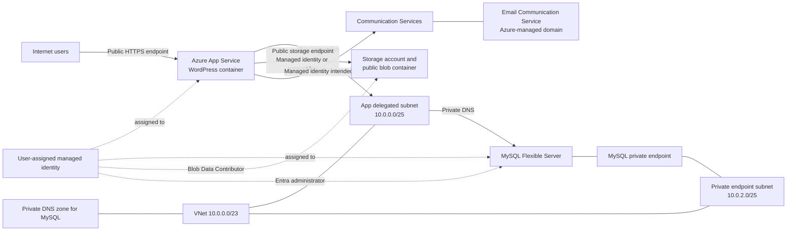

# Azure WordPress Bicep review and configuration guide

## Executive summary

The template deploys a containerized WordPress site on Azure App Service, backed by Azure Database for MySQL Flexible Server, Blob Storage, and Azure Communication Services Email. A user-assigned managed identity is used for MySQL, Blob Storage, and intended email authentication. MySQL is isolated through a private endpoint in the dedicated private-endpoint subnet and private DNS.

The template builds successfully without Bicep diagnostics. It has been normalized from its ARM-derived source into structured Bicep modules; production readiness still requires reviewing the selected resource SKUs, network topology, retention, and backup settings.

## Environment-specific deployment (current contract)

The current deployment contract uses one non-secret parameter file for each supported environment: `wordpress-deployment-arm-template.dev.parameters.json`, `wordpress-deployment-arm-template.test.parameters.json`, and `wordpress-deployment-arm-template.prod.parameters.json`. The values are deliberately explicit rather than inferred from the environment name, so production capacity and resilience changes are reviewable.

| Environment | App Service SKU/capacity | App Service zone redundancy | MySQL SKU/HA | Redis HA | Storage | Blob/container retention | WAF |
| --- | --- | --- | --- | --- | --- | --- | --- |
| `dev` | P1V3 / 1 | Disabled | Burstable B1ms / Disabled | Disabled | Standard_LRS | 7 / 7 days | Detection |
| `test` | P1V3 / 2 | Disabled | General Purpose D2ds v4 / SameZone | Enabled | Standard_ZRS | 14 / 14 days | Detection |
| `prod` | P1V3 / 3 | Enabled | General Purpose D2ds v4 / ZoneRedundant | Enabled | Standard_RAGRS | 30 / 30 days | Prevention |

`environmentName` accepts only `dev`, `test`, or `prod`, and is added as the `Environment` tag to tag-capable resources. `appServiceZoneRedundant` and `mysqlHighAvailabilityMode` are independent. The latter accepts `Disabled`, `SameZone`, or `ZoneRedundant`. App Service sizing uses `sku.name`, `sku.tier`, and `sku.capacity`; MySQL sizing uses `sku.name` and `sku.tier`. MySQL remains fixed on version 8.4.

The profiles also parameterize `vnetAddressSpace`, all three subnet prefixes, Blob/container soft-delete retention, Front Door health probe path and interval, and WAF mode. The private-endpoint subnet defaults to `10.0.0.128/26`, which is within the default `10.0.0.0/23` VNet and does not overlap the App Service subnet.

Security remains invariant across environments: Storage, Key Vault, and Redis retain private access and public-network denial; MySQL retains delegated private networking; and the Web App remains restricted to the specific Front Door profile. Profile files must not contain passwords, Redis keys, or actual workspace IDs.

Set `WORDPRESS_PASSWORD`, `MYSQL_PASSWORD`, and `LOG_ANALYTICS_WORKSPACE_RESOURCE_ID` in the process environment, then run:

```powershell
.\deploy.ps1 -Environment <dev|test|prod> -ResourceGroupName <resource-group> -SiteName <site-name> -WordPressAdminEmail <admin-email>
```

The script builds, validates, and runs what-if only. It contains no `az group create` or `az deployment group create` command. Azure validate/what-if still require an existing target resource group, authenticated Azure CLI, valid secure values, provider registration, regional SKU availability, quota, and the required role-assignment permissions.

The historical review sections below describe earlier template observations. The environment parameter names and coupling guidance in this section are authoritative.

The most important findings are:

1. **Storage is public by default.** The account permits public blob access and Shared Key access, its firewall default is `Allow`, and the container has anonymous blob-level access.
2. **The storage account key is injected into App Service settings** even though the managed identity already has `Storage Blob Data Contributor`. This defeats the intended keyless design.
3. **The App Service remains publicly reachable.** VNet integration controls outbound traffic; it does not create an inbound private endpoint.
4. **Only MySQL has private network isolation.** There are no private endpoints for App Service, Storage, Communication Services, Key Vault, or Redis.
5. **The same App Service `config/web` resource is declared in the main template and a nested module.** These deployments can update the same resource independently, which creates ordering and property-overwrite risk.
6. **The custom Communication Services role is likely insufficient for sending email.** It grants only management-plane `Read` and `Write` actions and no email-send data action. Validate this against the authentication contract expected by the WordPress image and replace it with the appropriate built-in role or a correctly defined custom role.
7. **The environment contract now uses supported sizing properties.** App Service instance count is supplied through `sku.capacity`, while MySQL compute comes from its SKU name and tier; the legacy worker and vCore parameters are removed.
8. **There are no diagnostics, Log Analytics, Key Vault, Redis, resource locks, Defender configuration, or deployment outputs.** These items mentioned in `notes.txt` are desired future work, not current behavior.
9. **The deployment script is stale.** It references `main.bicep` and `wp.dev.parameters.json`, neither of which exists in this folder.

## Scope reviewed

| File | Purpose |
| --- | --- |
| `wordpress-deployment-arm-template.bicep` | Main deployment and orchestration template. |
| `wordpress-deployment-arm-template.parameters.json` | Example values, currently targeting South Africa North. Required names and passwords are blank. |
| `modules/add-admins.bicep` | Makes the user-assigned identity the MySQL Microsoft Entra administrator. |
| `modules/server-parameters-aad-auth-only.bicep` | Enables MySQL `aad_auth_only`. |
| `modules/subnet-resources.bicep` | Creates the App Service, database, and private-endpoint subnets. |
| `modules/app-service-resources.bicep` | Writes App Service configuration, including application settings and email settings. |
| `modules/storage-resources.bicep` | Configures the blob service and media container. |
| `modules/storage-role-assignment-managed-identity.bicep` | Grants the identity `Storage Blob Data Contributor`. |
| `deploy.ps1` | Example workflow, but its filenames do not match the repository. |
| `notes.txt` | Future architecture requirements; none of the Redis, Key Vault, private endpoint, or diagnostics work is implemented. |

## Architecture actually deployed



### Network interpretation

- The MySQL server uses a private endpoint in the dedicated private-endpoint subnet and private DNS. `publicNetworkAccess` defaults to `Disabled`.
- The App Service uses regional VNet integration through `Microsoft.Web/sites/networkConfig`. This is outbound integration only.
- The App Service has no private endpoint and no access restrictions. Its normal public hostname remains reachable.
- The storage account has no private endpoint and no `publicNetworkAccess: 'Disabled'` setting.
- The storage firewall defaults to `Allow`, so the public storage endpoint is reachable from any network, subject to authorization. The media container additionally permits anonymous reads of individual blobs.
- No NSGs, route tables, NAT Gateway, Azure Firewall, or private endpoint subnet are created.

## Resource inventory

The modules compile to nested `Microsoft.Resources/deployments` entries in deployment history. Ignoring those orchestration entries, the template creates approximately 25 distinct Azure resource IDs:

| Area | Resource | Name pattern or value | Important behavior |
| --- | --- | --- | --- |
| Compute | App Service plan | `asp-{name}-{suffix}` | Linux Premium v3, three workers by default, zone redundancy enabled. |
| Compute | Web App | `{name}` | Public App Service running a site container. |
| Compute | Site container | `main` | Image `mcr.microsoft.com/appsvc/wordpress-debian-php:8.4`, port 80. |
| Compute | Web configuration | `{name}/web` | `alwaysOn` plus application settings. Declared from two deployment paths. |
| Networking | VNet | `{name}-vnet` | Address space `10.0.0.0/23`. |
| Networking | App subnet | `{name}-appsubnet` | `10.0.0.0/25`, delegated to `Microsoft.Web/serverFarms`. |
| Networking | Database subnet | `{name}-dbsubnet` | `10.0.1.0/25`, delegated to MySQL Flexible Server. |
| Networking | App VNet integration | `{name}/virtualNetwork` | Connects App Service outbound traffic to the app subnet. |
| DNS | Private DNS zone | `{name}-{suffix}.private.mysql.database.azure.com` | MySQL private name resolution. |
| DNS | VNet link | Deterministic GUID | Links the VNet to the private DNS zone. |
| Identity | User-assigned identity | `{name}-identity` | Assigned to App Service and MySQL. |
| Database | MySQL Flexible Server | `{name}-mysql-{suffix}` | MySQL 8.0.21, private access, Entra-only authentication after deployment. |
| Database | Database | `{sanitizedName}_db` | `utf8` / `utf8_general_ci` by default. |
| Database | MySQL configuration | `sql_generate_invisible_primary_key` | Set to `OFF`. |
| Database | MySQL configuration | `aad_auth_only` | Set to `ON`; password authentication is disabled after configuration. |
| Database | Entra administrator | `ActiveDirectory` | The same user-assigned identity is made server administrator. |
| Storage | Storage account | Generated lowercase name | StorageV2, RA-GRS, public network allowed, Shared Key allowed. |
| Storage | Blob service | `default` | Seven-day blob and container soft delete; no versioning or change feed. |
| Storage | Blob container | Generated `blob...` name | Anonymous blob-level public access by default. |
| RBAC | Storage role assignment | Deterministic GUID | Grants `Storage Blob Data Contributor` to the identity. |
| Email | Email Communication Service | `{name}-email-acs` | Global resource, data geography selected by `emailDataLocation`. |
| Email | Azure-managed domain | `AzureManagedDomain` | Engagement tracking disabled. |
| Email | Communication Service | `{name}-acs` | Global resource linked to the managed email domain. |
| RBAC | Custom role definition | Generated GUID | Communication Service read/write management actions only. |
| RBAC | Communication role assignment | Deterministic GUID | Assigns the custom role to the identity at Communication Service scope. |

### Naming behavior

`uniqueString(resourceGroup().id, name)` produces a deterministic suffix. Reusing the same resource group and `name` produces the same generated names. Changing either produces a different MySQL server, plan, storage account, DNS zone, and deployment ID.

`name` is also the Web App name and therefore must be globally unique. Keep it short because it is reused in several resource names. Lowercase letters, digits, and hyphens are the safest convention. The storage name removes hyphens and underscores, takes at most the first 11 characters plus `wp`, and appends the deterministic suffix.

## Runtime configuration and data flow

### WordPress container

The Web App runs the Microsoft Container Registry image supplied by `siteContainerImage`. The site container uses anonymous registry access and receives WordPress settings from App Service app settings and connection strings.

The template does not pin an image digest. A mutable tag can change over time, so production deployments should test and promote a known image digest or controlled version.

### WordPress administrator bootstrap

`wordpressAdminEmail`, `wordpressUsername`, and `wordpressPassword` are stored as App Service connection strings. `wordpressPassword` is a secure deployment parameter, but once deployed it exists in App Service configuration and is available to principals that can read application configuration.

No Key Vault reference is used. Rotating the deployment parameter alone does not prove that an already-installed WordPress administrator password will be changed inside WordPress.

### MySQL authentication

Deployment initially creates the MySQL server with `serverUsername` and `serverPassword`. It then:

1. Assigns the user-managed identity to MySQL.
2. Configures that identity as the Microsoft Entra administrator.
3. Sets `aad_auth_only` to `ON`.
4. Configures WordPress with `ENABLE_MYSQL_MANAGED_IDENTITY=true`, `ENTRA_CLIENT_ID`, and the identity name as `DATABASE_USERNAME`.

After `aad_auth_only` is enabled, password authentication is disabled. The original server administrator password remains a creation input but is not the intended runtime credential. Confirm that the selected WordPress image version supports this exact managed-identity bootstrap contract before changing the image.

### Blob media

The identity receives `Storage Blob Data Contributor`, and WordPress is configured with `ENABLE_BLOB_MANAGED_IDENTITY=true`. However, the template also calls `listKeys()` and writes `STORAGE_ACCOUNT_KEY` into App Service settings. This produces two authorization paths and exposes a credential with broad account access.

The default container access level is `blob`, meaning anonymous clients can read a blob if they know its URL. Anonymous container listing is not enabled at this level. This may be intentional for directly served WordPress media, but it should be an explicit architecture decision rather than a default.

### Email

The template creates an Azure-managed email domain and forms this application setting:

```text
endpoint=https://{communication-service-host};senderaddress=DoNotReply@{managed-domain}
```

`ENABLE_EMAIL_MANAGED_IDENTITY` is enabled. The custom RBAC role only contains:

```text
Microsoft.Communication/CommunicationServices/Read
Microsoft.Communication/CommunicationServices/Write
```

It has no `dataActions`. Treat email send authorization as unverified until a deployment and send test succeeds. Prefer a documented built-in role when one matches the image's authentication method.

## Complete parameter reference

### Required identity and bootstrap parameters

| Parameter | Default | What it controls | Guidance |
| --- | --- | --- | --- |
| `name` | None | Web App name and prefix for most resources. | Required. Use a short, globally unique, lowercase name. Changing it creates a parallel deployment rather than renaming existing resources. |
| `wordpressAdminEmail` | None | WordPress bootstrap admin email. | Required. Use a monitored address. It is stored in App Service configuration. |
| `wordpressUsername` | `wpadmin` | WordPress bootstrap administrator name. | Change from a predictable default for production. |
| `wordpressPassword` | None, secure | WordPress bootstrap password. | Required. Supply from a secure pipeline or Key Vault-backed deployment process; do not commit it. A future design should use a Key Vault reference. |
| `wpLocaleCode` | `en_US` | WordPress locale passed to the container. | Examples include `en_US`, `en_GB`, or another locale supported by the image/WordPress. |
| `serverUsername` | `wpdbadmin` | Initial local MySQL administrator. | Used during server creation even though Entra-only auth is enabled later. Avoid reserved names. |
| `serverPassword` | None, secure | Initial local MySQL administrator password. | Required at creation. Supply securely. It is not the intended runtime credential after `aad_auth_only=ON`. |

### Location and email parameters

| Parameter | Default | What it controls | Guidance |
| --- | --- | --- | --- |
| `location` | `West Europe` | Region for App Service, MySQL, VNet, identity, and Storage. | Choose a region supporting the selected SKUs and availability zones. The example parameter file uses `southafricanorth`. Prefer `resourceGroup().location` in a future cleanup. |
| `emailDataLocation` | `unitedstates` | Communication Services data-at-rest geography. | This is a geography, not the same concept as `location`. Choose according to residency requirements and supported ACS values. Use the exact service-supported spelling/casing verified during validation. |

### App Service plan and container parameters

| Parameter | Default | What it controls | Guidance |
| --- | --- | --- | --- |
| `enableZoneRedundancy` | `true` | Both App Service plan zone redundancy and MySQL HA mode. | Coupled setting. `true` requires regional/SKU support and at least two App Service instances. `false` disables both App Service zone redundancy and MySQL HA. Split this into two parameters in a future revision. |
| `sku` | `PremiumV3` | App Service plan tier. | Must agree with `skuCode`. Do not change independently. Premium v2-v4 tiers support App Service zone redundancy where available. |
| `skuCode` | `P1V3` | App Service plan size. | Examples within the same tier include `P1V3`, `P2V3`, and `P3V3`; verify region availability and current pricing. |
| `workerSize` | `6` | Legacy/decompiled App Service property. | Do not tune directly. The compiler does not recognize it for this API shape. Modernize the template to use `sku.capacity` and remove this parameter. |
| `workerSizeId` | `6` | Legacy/decompiled App Service property. | Do not tune directly; modernize with current API/schema. |
| `numberOfWorkers` | `3` | Intended App Service instance count. | Current guidance uses `sku.capacity`. If zone redundancy is enabled, capacity must be at least two. Verify the deployed count because the current property is schema-invalid. |
| `kind` | `linux` | App Service plan operating system family. | Keep `linux`; the selected WordPress image and `reserved=true` depend on Linux. |
| `reserved` | `true` | Marks the App Service plan as Linux. | Keep `true` with `kind=linux`. |
| `alwaysOn` | `true` | Prevents the Web App from unloading while idle. | Keep `true` for production. It requires a supported paid tier. |
| `ftpsState` | `FtpsOnly` | FTP deployment access mode. | Prefer `Disabled` if FTP/FTPS deployment is not required. Never use plain FTP. |
| `autoGeneratedDomainNameLabelScope` | `TenantReuse` | Intended App Service hostname reuse scope. | Compiler flags it on the old site API. Verify support or remove it during API modernization. |
| `linuxFxVersion` | `sitecontainers` | Enables the App Service site-containers model. | Keep aligned with the child `sites/sitecontainers` resource. Treat as an implementation setting, not a routine tuning option. |
| `siteContainerName` | `main` | Child site-container name. | Keep a valid alphanumeric/hyphen name. Changing it can create a second child container; only one should be `isMain=true`. |
| `siteContainerImage` | Microsoft WordPress PHP 8.4 image | Container image. | Change only to a compatible image that supports the documented environment variables and managed identity flows. Pin/test a digest for controlled production releases. |

### MySQL parameters

| Parameter | Default | What it controls | Guidance |
| --- | --- | --- | --- |
| `vmName` | `Standard_D2ds_v4` | MySQL compute SKU. | This SKU determines compute size. Burstable SKUs reduce dev/test cost but do not support HA. Verify availability in the target region. |
| `serverEdition` | `GeneralPurpose` | MySQL tier. | Keep aligned with `vmName`: commonly `Burstable`, `GeneralPurpose`, or `MemoryOptimized` as supported. |
| `vCores` | `2` | Written to MySQL `sku.capacity`. | The compiler flags this property. Treat `vmName` as authoritative and remove `vCores` during modernization. |
| `storageSizeGB` | `128` | MySQL allocated storage. | Size for database growth, backup/restore needs, and IOPS characteristics. Storage generally cannot be reduced in place. |
| `storageIops` | `700` | Requested provisioned IOPS. | With auto I/O scaling enabled, confirm whether the service ignores/conflicts with fixed IOPS. Use one deliberate IOPS strategy. |
| `storageAutoGrow` | `Enabled` | Automatic MySQL storage growth. | Recommended for production. HA servers require autogrow. Accepted values are `Enabled` or `Disabled`. |
| `storageAutoIoScaling` | `Enabled` | Autoscale IOPS. | Useful for variable workloads. Disable only when intentionally using predictable pre-provisioned IOPS. |
| `backupRetentionDays` | `7` | Point-in-time backup retention. | Flexible Server supports up to 35 days. Increase based on recovery policy and cost. |
| `geoRedundantBackup` | `Disabled` | Geo-redundant backups. | Enable only in supported regions and when cross-region recovery is required; it increases cost. |
| `publicNetworkAccess` | `Disabled` | MySQL public endpoint access. | Keep `Disabled` for the current delegated-VNet design. Enabling it changes the security posture and still requires firewall rules. |
| `charset` | `utf8` | Database character set. | For a new implementation, assess `utf8mb4` for full Unicode support, but verify image/schema compatibility before changing. |
| `collation` | `utf8_general_ci` | Database collation. | Must be compatible with `charset` and application expectations. Changing existing database collation is a migration, not merely an infrastructure toggle. |

### Storage parameters

| Parameter | Default | What it controls | Guidance |
| --- | --- | --- | --- |
| `storageAccountType` | `Standard_RAGRS` | Storage replication SKU. | `Standard_LRS` lowers dev/test cost; `Standard_ZRS` provides zonal resilience; GRS/RA-GRS add cross-region replication. Choose from the options supported in the region and by the recovery design. |
| `storageAccountKind` | `StorageV2` | Storage account kind. | Keep `StorageV2` for modern Blob features. |
| `accessTier` | `Hot` | Default Blob access tier. | `Hot` suits frequently accessed WordPress media. Cool/cold tiers can add retrieval costs and are usually poor defaults for active media. |
| `minimumTlsVersion` | `TLS1_2` | Minimum Storage TLS version. | Keep at least TLS 1.2. Use a newer supported value only after client compatibility testing. |
| `supportsHttpsTrafficOnly` | `true` | Requires HTTPS for Storage. | Keep `true`. |
| `allowBlobPublicAccess` | `true` | Whether containers may enable anonymous access. | Set `false` for private media. It must be consistent with `blobPublicAccessLevel`; setting this false while the container requests `blob` can fail deployment. |
| `allowSharedKeyAccess` | `true` | Allows account-key authorization. | Microsoft recommends `false` when managed identity is supported. The template must first stop calling `listKeys()` and remove `STORAGE_ACCOUNT_KEY`. |
| `allowCrossTenantReplication` | `true` | Allows object replication across tenants. | Set `false` unless cross-tenant object replication is a requirement. |
| `networkAclsBypass` | `AzureServices` | Allows selected trusted Azure services through the firewall. | Use only when required. It does not make the current `Allow` firewall restrictive. |
| `networkAclsDefaultAction` | `Allow` | Storage firewall default. | `Deny` is safer, but the current template has no subnet rules or private endpoint. Changing only this value is likely to break WordPress access. |
| `keySource` | `Microsoft.Storage` | Storage encryption key source. | Keep for Microsoft-managed keys. Customer-managed keys require Key Vault, identity, and additional properties not present here. |
| `encryptionEnabled` | `true` | Encryption for blob, file, table, and queue services. | Keep `true`. |
| `infrastructureEncryptionEnabled` | `false` | Additional infrastructure encryption layer. | Enable only if required by compliance and supported by the selected account/region; assess cost and constraints. |
| `blobPublicAccessLevel` | `blob` | Anonymous access level of the media container. | Use `None` for private media, but represent it correctly in Bicep rather than assuming the string is accepted. `blob` allows anonymous reads of known blob URLs. Do not use `container` unless anonymous listing is explicitly required. |

## Parameter coupling and unsafe combinations

The template exposes parameters that look independent but are not:

| Combination | Consequence |
| --- | --- |
| `enableZoneRedundancy=true` plus fewer than two App Service instances | Invalid or noncompliant zone-redundant App Service configuration. |
| `enableZoneRedundancy=true` plus a Burstable MySQL tier | MySQL deployment fails because Burstable does not support HA. |
| `sku` changed without `skuCode` | Tier/name mismatch or unexpected plan selection. |
| `serverEdition` changed without `vmName` | MySQL tier/SKU mismatch. |
| `allowBlobPublicAccess=false` plus `blobPublicAccessLevel='blob'` | Conflicting account/container policy; deployment may fail. |
| `allowSharedKeyAccess=false` while `listKeys()` and `STORAGE_ACCOUNT_KEY` remain | Deployment/runtime behavior is inconsistent with a keyless design. Remove key retrieval first. |
| `networkAclsDefaultAction='Deny'` without private endpoint or service endpoint rules | App Service loses access to WordPress media storage. |
| `storageAutoIoScaling='Enabled'` plus a manually selected `storageIops` | Ambiguous IOPS strategy; confirm service behavior and retain only the intended mode. |
| Changing `name` or resource group | Generates a new suffix and mostly new resources; this is not an in-place rename. |
| Changing charset/collation after WordPress contains data | Infrastructure redeployment does not migrate existing table encodings. |

## Implementation options

### Option 1: Low-cost development/test using parameter changes only

Use the existing topology but reduce redundancy and replication:

| Parameter | Suggested value | Reason |
| --- | --- | --- |
| `enableZoneRedundancy` | `false` | Avoids multi-instance App Service and MySQL standby costs. |
| `numberOfWorkers` | `1` | Intended single App Service worker; verify after deployment because the current property needs modernization. |
| `sku` / `skuCode` | Keep `PremiumV3` / `P1V3` initially | Lowest-risk change while site-containers compatibility is confirmed. Test a cheaper supported tier separately. |
| `serverEdition` / `vmName` | `Burstable` / a supported B-series MySQL SKU | Reduces database compute cost. Verify the exact SKU in the chosen region. |
| `storageAccountType` | `Standard_LRS` | Lowest-cost local replication. |
| `backupRetentionDays` | `7` | Minimum current policy in the template. |
| `geoRedundantBackup` | `Disabled` | Avoids geo-backup cost. |

This option is not production hardened. Storage and the Web App remain public.

### Option 2: Balanced production using parameter changes only

The current defaults approximate a highly available production profile:

- P1v3 App Service plan with three intended workers.
- App Service zone redundancy enabled.
- General Purpose MySQL with zone-redundant HA.
- Storage autogrow and autoscale IOPS.
- RA-GRS Blob Storage.

Review these values before accepting the cost. For a balanced profile, keep at least two App Service instances when zone redundancy is enabled, size MySQL from measured CPU/memory/IOPS, and choose ZRS versus GRS/RA-GRS based on whether the recovery requirement is zonal or regional.

Parameter changes alone cannot make this option private or keyless.

### Option 3: Private, keyless production architecture

This is the recommended production direction, but it requires Bicep changes rather than only parameter changes:

1. Upgrade resource API versions and remove decompiler artifacts.
2. Consolidate all App Service web configuration into one resource declaration.
3. Add an App Service private endpoint and `privatelink.azurewebsites.net` private DNS, then disable or restrict public inbound access.
4. Add a dedicated private-endpoint subnet. Do not place private endpoints in delegated App Service or MySQL subnets.
5. Add a Blob private endpoint and `privatelink.blob.core.windows.net` private DNS.
6. Set Storage public network access to disabled, firewall default to `Deny`, anonymous blob access to false, and Shared Key access to false.
7. Remove `listKeys()` and `STORAGE_ACCOUNT_KEY`; retain managed identity plus least-privilege Blob RBAC.
8. Add Key Vault with RBAC, private endpoint, private DNS, soft delete, and purge protection. Use App Service Key Vault references for secrets that must exist in application settings.
9. Add Azure Managed Redis only if workload testing shows a cache/session need. Use private access and store any unavoidable access key in Key Vault; prefer identity-based access where supported by the selected service and client.
10. Add diagnostic settings for supported resources and send logs/metrics to a parameterized Log Analytics workspace.
11. Add an appropriate Communication Services email role and an automated send smoke test.
12. Add resource locks and backup/restore tests according to the environment policy.

### Option 4: Public media by design

If WordPress media must be directly readable without application proxying, anonymous blob access can be retained, but use a deliberate delivery architecture:

- Prefer Azure Front Door/CDN in front of the origin.
- Restrict the storage origin where the selected service supports it.
- Keep container listing disabled.
- Separate public media from private uploads.
- Add lifecycle, versioning/change feed, malware scanning, and diagnostic policies as required.

The current anonymous `blob` setting exposes known blob URLs directly from Storage and provides no WAF, custom-domain TLS termination, or edge policy.

## Review findings and recommended priority

### Critical/high priority

| Finding | Impact | Recommendation |
| --- | --- | --- |
| Public blob access, public storage firewall, and Shared Key are enabled | Media exposure and credential-based account access. | Decide whether media is public. For private media, implement private endpoint + DNS, disable public network/anonymous/Shared Key access, and remove the key setting. |
| Storage key is copied to App Service configuration | Any principal able to read app configuration can obtain broad Storage credentials. | Use only managed identity and Blob RBAC. |
| Duplicate App Service `config/web` declarations | Non-deterministic updates or one deployment overwriting properties written by another. | Merge `alwaysOn` and all app settings into one child resource with one owner. |
| Communication Services role does not express email-send permission | Email may fail despite `ENABLE_EMAIL_MANAGED_IDENTITY=true`. | Replace with the documented least-privilege email role and test sending. |
| App Service has no explicit `httpsOnly: true`, private endpoint, or access restrictions | Public HTTP/inbound exposure may not meet production policy. | Enforce HTTPS and select public-with-WAF or private-inbound architecture. |

### Medium priority

| Finding | Impact | Recommendation |
| --- | --- | --- |
| Old APIs and schema-invalid properties | Values may be ignored, rejected, or behave differently than expected. | Move to supported stable APIs and current resource schemas. |
| App worker count and MySQL vCore parameters use questionable properties | Cost/capacity may differ from requested values. | Use App Service `sku.capacity`; use the MySQL SKU as the compute source of truth. |
| One boolean controls two unrelated HA decisions | Cannot choose App Service and database availability independently. | Add `enableAppServiceZoneRedundancy` and `mysqlHighAvailabilityMode`. |
| No diagnostics or Log Analytics | Limited incident response, auditing, and capacity evidence. | Parameterize a workspace resource ID and add category-group based diagnostic settings where supported. |
| No Key Vault | Bootstrap and account secrets reside in deployment/app configuration. | Add Key Vault references and a rotation design. Do not store a MySQL password that runtime no longer needs. |
| No outputs | Deployment automation must rediscover resource names and hostname. | Output Web App hostname, resource IDs, generated names, and private endpoint/DNS details. Do not output secrets. |
| No parameter decorators | Invalid values reach ARM late. | Add `@description`, `@allowed`, `@minValue`, `@maxValue`, length constraints, and secure types. |

### Cleanup/maintainability

- Rename decompiler-generated symbols to concise domain names.
- Remove unused API-version parameters and variables.
- Replace unnecessary `dependsOn` entries with symbolic references.
- Use `parent` for child resources consistently.
- Replace hardcoded `core.windows.net` with `environment().suffixes.storage` for Azure cloud portability.
- Replace manual role-definition IDs with well-named constants or Azure Verified Module conventions.
- Add tags as a parameter and apply them consistently.
- Consider Azure Verified Modules for standard resources after the target architecture is agreed.

## Compiler validation

Command used:

```powershell
az bicep build --file .\wordpress-deployment-arm-template.bicep
```

Result: **build succeeded with warnings and no compiler errors** using Bicep CLI 0.43.8. Version 0.46.1 was available at review time.

Warning categories included:

- unused variables and module parameters;
- decompiler cleanup and unnecessary string interpolation;
- hardcoded Azure public-cloud Storage DNS suffix;
- properties not recognized by current type definitions on Web App, App Service plan, MySQL, and managed identity resources;
- unnecessary explicit dependencies; and
- child resources that should use `parent`.

A successful local build proves syntax/module compilation only. It does not prove regional SKU availability, quota, RBAC permission, provider registration, runtime image compatibility, or successful WordPress/email initialization.

## Validation and deployment workflow

### 1. Upgrade and compile

```powershell
az bicep upgrade
az bicep build --file .\wordpress-deployment-arm-template.bicep
```

### 2. Validate against Azure

```powershell
az deployment group validate `
  --resource-group <resource-group> `
  --name wordpress-validate `
  --template-file .\wordpress-deployment-arm-template.bicep `
  --parameters .\wordpress-deployment-arm-template.parameters.json
```

This requires nonblank `name`, `wordpressPassword`, and `serverPassword` values. Avoid storing real passwords in the committed parameter file. Prefer secure pipeline variables, environment variables, or a Key Vault reference in a deployment parameter mechanism.

### 3. Preview changes

```powershell
az deployment group what-if `
  --resource-group <resource-group> `
  --name wordpress-whatif `
  --template-file .\wordpress-deployment-arm-template.bicep `
  --parameters .\wordpress-deployment-arm-template.parameters.json
```

Review replacements and deletions carefully, especially when changing `name`, location, networking, MySQL HA, Storage redundancy, or immutable creation-time settings.

### 4. Deploy

```powershell
az deployment group create `
  --resource-group <resource-group> `
  --name wordpress-deploy `
  --template-file .\wordpress-deployment-arm-template.bicep `
  --parameters .\wordpress-deployment-arm-template.parameters.json `
  --parameters wordpressPassword=$env:WORDPRESS_PASSWORD serverPassword=$env:MYSQL_PASSWORD
```

### 5. Runtime smoke tests

After deployment, verify all of the following:

1. The Web App returns HTTPS successfully and redirects/rejects HTTP as intended.
2. The container starts from the expected image and remains healthy after restart/scale-out.
3. WordPress can create/read/update database records using managed identity.
4. WordPress can upload and retrieve media using managed identity after removing any storage-key fallback.
5. Anonymous media behavior matches the selected public/private design.
6. A test email sends through the managed identity and expected sender domain.
7. MySQL resolves to a private address from the App Service VNet integration path.
8. Backup restore is tested, not only configured.
9. Logs and metrics arrive in Log Analytics once diagnostics are implemented.

## What parameter changes cannot implement

The following require new or changed resources/properties and cannot be achieved with the current parameters:

- Azure Managed Redis;
- Key Vault, secrets, keys, RBAC, or Key Vault references;
- any private endpoint or private endpoint DNS zone;
- inbound-private App Service;
- Storage public network access disabled;
- diagnostic settings or a Log Analytics workspace;
- App Service access restrictions, Front Door, WAF, or custom domain/certificate;
- autoscale rules;
- deployment slots;
- resource locks;
- customer-managed encryption keys;
- managed identities split by workload/resource boundary;
- custom email domain verification; and
- backup restore automation or disaster-recovery orchestration.

## Recommended next implementation sequence

1. Correct the existing template: current APIs, one App Service config owner, valid capacity fields, secure HTTPS, parameter decorators, outputs, and a working deployment script.
2. Make Storage keyless and private, then prove media upload/read through managed identity.
3. Correct and test Communication Services managed-identity authorization.
4. Add centralized diagnostics and alerts.
5. Add Key Vault only for secrets that remain necessary; avoid recreating secrets for identity-capable services.
6. Add App Service private inbound access or a controlled public edge according to user-access requirements.
7. Add Redis only after defining its purpose, data classification, persistence/HA requirements, and cache failure behavior.

## Microsoft documentation references

- [Configure App Service plans for zone redundancy](https://learn.microsoft.com/azure/app-service/configure-zone-redundancy)
- [Reliability in Azure App Service](https://learn.microsoft.com/azure/reliability/reliability-app-service)
- [Azure Database for MySQL Flexible Server high availability](https://learn.microsoft.com/azure/mysql/flexible-server/concepts-high-availability)
- [Azure Database for MySQL Flexible Server storage IOPS](https://learn.microsoft.com/azure/mysql/flexible-server/concepts-storage-iops)
- [Secure your Azure Storage account](https://learn.microsoft.com/azure/storage/common/secure-storage)
- [Prevent Shared Key authorization for Azure Storage](https://learn.microsoft.com/azure/storage/common/shared-key-authorization-prevent)
- [Authorize access to data in Azure Storage](https://learn.microsoft.com/azure/storage/common/authorize-data-access)
- [Azure Communication Services email overview](https://learn.microsoft.com/azure/communication-services/concepts/email/email-overview)
- [Email domains and sender authentication](https://learn.microsoft.com/azure/communication-services/concepts/email/email-domain-and-sender-authentication)
- [App Service site containers CLI reference](https://learn.microsoft.com/cli/azure/webapp/sitecontainers)

## Implemented hardening update

The template now implements the approved public-edge design with Azure Front Door **Standard** and a managed WAF policy. The Web App intentionally has no private endpoint. Instead, it is HTTPS-only and has an App Service access restriction that permits the `AzureFrontDoor.Backend` service tag only when the request carries the unique `X-Azure-FDID` of the deployed Front Door profile.

The deployment now creates a dedicated `10.0.2.0/25` private-endpoint subnet, private DNS zones, and private endpoints for Blob Storage, Key Vault, and Azure Managed Redis. Storage public access, anonymous Blob access, Shared Key access, and cross-tenant replication are disabled. The Web App retains `Storage Blob Data Contributor` and no longer receives a storage account key.

Key Vault uses RBAC authorization, soft delete, purge protection, and a private endpoint. It stores the WordPress administrator password, the MySQL bootstrap password, and the Redis primary access key. The Web App identity receives Key Vault Secrets User and Key Vault Crypto User. Redis access-key authentication remains enabled because the selected WordPress plugin requires a Redis password; App Service exposes it only through Key Vault references (`REDIS_PASSWORD` and `WP_REDIS_PASSWORD`).

The new MySQL server target is version 8.4. Existing VNet-integrated MySQL is not converted to Private Link automatically because that migration is disruptive and one-way. Centralized diagnostic settings are configured for every deployed resource type that supports them, using the required `logAnalyticsWorkspaceResourceId` parameter.

### Storage delivery limitation without Front Door Premium

Front Door Standard cannot use a private Blob endpoint as an origin. Browser-facing media must therefore be served by WordPress or through short-lived user-delegation SAS URLs. Direct public Blob URLs are intentionally not supported by this implementation. This is the security tradeoff that removes the Premium Front Door dependency.

### Required pre-deployment checks

1. Confirm Azure Managed Redis `Balanced_B0` (or the chosen parameterized SKU) is available in the target region and subscription.
2. Run `az deployment group validate` and `what-if` with a real Log Analytics workspace resource ID.
3. Confirm the chosen WordPress Redis plugin supports TLS, port `10000`, and the configured `REDIS_PASSWORD` or `WP_REDIS_PASSWORD` variable.
4. After deployment, confirm the direct App Service hostname returns `403`, while the Azure Front Door endpoint succeeds.
5. Verify private DNS resolution and media upload/read behavior from App Service before switching production traffic.
