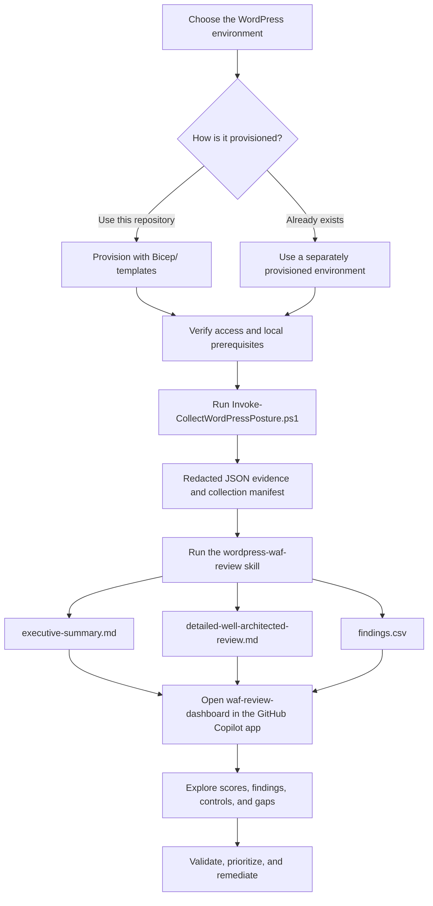

# Azure WordPress Toolkit

> **GitHub Copilot skill and app canvas included:** This repository provides the `wordpress-waf-review` skill for generating an evidence-based Azure Well-Architected review and the `waf-review-dashboard` GitHub Copilot app canvas extension for visualizing the generated report. Ask Copilot Chat to **"Run the WordPress WAF review using evidence in `Evidence/<collection-folder>` and open the report dashboard"**. See [SKILLSREADME.md](SKILLSREADME.md) for skill usage and the [dashboard README](.github/extensions/waf-review-dashboard/README.md) for canvas details.

This repository contains everything needed to deploy, operate, back up, and restore a containerized WordPress site on Azure:

- **[Bicep/](Bicep/)** — Infrastructure as Code that provisions the full Azure environment (App Service, MySQL Flexible Server, VNet/private endpoints, Storage, Key Vault, Redis, Front Door + WAF, Communication Services email).
- **[HelperScript/](HelperScript/)** — PowerShell operational scripts that run WP-CLI commands, back up, and restore a deployed site over an authenticated Azure tunnel (no public SSH/FTP required), plus a Redis cache setup helper.
- **[Review/](Review/)** — PowerShell collectors that gather redacted configuration evidence from a deployed environment, plus Well-Architected checklists and a report-generation prompt for turning that evidence into findings.
- **[Skills/](Skills/)** — GitHub Copilot skills for automating the review of WordPress on Azure App Service workloads, including the `wordpress-waf-review` skill.
- **[waf-review-dashboard](.github/extensions/waf-review-dashboard/README.md)** — GitHub Copilot app canvas extension that visualizes the generated review as an interactive scorecard, findings dashboard, control heatmap, and remediation view.

Together they cover the full lifecycle: **deploy → configure → operate → back up → restore/DR → review**.

## High-level review workflow

A review starts with a deployed WordPress environment in Azure. You can create that environment with the Bicep templates in this repository, or review an existing environment that was provisioned separately. The environment does not need to have been deployed from this repository, but it must be accessible to the Azure identity running the collector.

1. **Prepare the environment and reviewer workstation.** Deploy WordPress and its Azure resources by following [Bicep/README.md](Bicep/README.md), or use an independently provisioned WordPress on Azure App Service environment. Install PowerShell 7 and Azure CLI, run `az login`, select the correct subscription, and ensure the signed-in identity has at least `Reader` access. `Monitoring Reader` and `Security Reader` improve evidence coverage.
2. **Collect evidence.** Run `Review/PSScripts/Invoke-CollectWordPressPosture.ps1` against the deployed resource group. The read-only collector inventories the environment and writes redacted JSON evidence, including `collection-manifest.json`, to the chosen output directory.
3. **Generate the review.** Ask GitHub Copilot to run the `wordpress-waf-review` skill against the evidence directory. The skill assesses the evidence against [Review/reviewdocs/AzureWordPressChecklist.md](Review/reviewdocs/AzureWordPressChecklist.md) and produces the executive summary, detailed review, and findings CSV.
4. **Visualize the report.** Open the included `waf-review-dashboard` canvas in the GitHub Copilot app. It reads the three report files and displays the score, coverage, pillars, findings, all 157 controls, remediation plan, and collection gaps interactively. The canvas does not call Azure, modify the reports, or recalculate scores.
5. **Review and act on findings.** Confirm evidence gaps and manually verified controls, prioritize the findings, and use the recommendations to plan remediation. Resource changes are not performed by the collector, review skill, or dashboard.



## Repository layout

```
Bicep/
  wordpress-deployment-arm-template.bicep            # Main IaC template
  wordpress-deployment-arm-template.dev.parameters.sample.json
  wordpress-deployment-arm-template.prod.parameters.sample.json
  deployDev.ps1, deployProd.ps1                       # Deployment helper scripts
  modules/                                            # Bicep modules composed by the main template
  README.md                                           # Deployment/usage guide (see below)
  wordpressbicep.md                                   # Detailed architecture review & hardening notes
HelperScript/
  Backup-AzureWordpress.ps1                           # Backup to local disk or Blob Storage
  Restore-AzureWordpressBackup.ps1                     # Disaster-recovery restore (full overwrite)
  RestoreFromLocal.ps1                                # Merge a local DB/files dump into an Azure site
  Invoke-WpCommand.ps1                                 # Run arbitrary WP-CLI commands / interactive shell
  SetupRedis.ps1                                       # Wire W3 Total Cache to Azure Managed Redis
  restorenotes.txt                                    # Example end-to-end DR runbook (restore + Redis + AFD purge)
  README.md                                            # Backup script usage guide (see below)
Review/
  PSScripts/                                          # Invoke-CollectWordPressPosture.ps1 and its per-resource collectors
  reviewdocs/AzureWordPressChecklist.md                # Canonical Well-Architected review checklist for this workload
  genreport.md                                         # Prompt reference for generating review reports from collected evidence
  README.md                                            # Evidence-collection and review workflow guide (see below)
.github/skills/wordpress-waf-review/                   # Copilot skill that generates the scored WAF review
.github/extensions/waf-review-dashboard/               # Copilot app canvas that visualizes generated reports
SKILLSREADME.md                                        # Skill installation, invocation, inputs, and outputs
```

## Prerequisites (all components)

- **Azure CLI**, authenticated (`az login`) with `Owner`/`User Access Administrator` (for Bicep role assignments) or `Contributor`/`Website Contributor` (for the helper scripts).
- **PowerShell 7+** for every script in this repo.
- For `Bicep/`: the Az Bicep CLI integration (`az bicep install` / `az bicep upgrade`).
- For `HelperScript/`: the `Posh-SSH` PowerShell module (`Install-Module Posh-SSH -Scope CurrentUser`).

## 1. Deploy the infrastructure (`Bicep/`)

The Bicep template deploys a WordPress container on Azure App Service (Linux, site-containers) with:

- Azure Database for MySQL Flexible Server (private, Microsoft Entra-only authentication via managed identity)
- A VNet with dedicated app, database, and private-endpoint subnets, plus private DNS
- A storage account/blob container for media, Key Vault, and Azure Managed Redis (all private-endpoint isolated)
- Azure Front Door Standard with a managed WAF policy as the sole public entry point (direct App Service access returns `403`)
- Azure Communication Services for outbound email
- A user-assigned managed identity used for keyless access to MySQL, Storage, and Redis

The template supports `dev`, `test`, and `prod` environment settings. Committed parameter-file samples are provided for `dev` and `prod`; create a local `test` parameter file from the closest sample when needed:

| Environment | App plan | MySQL HA | Redis HA | Storage redundancy | WAF mode |
| --- | --- | --- | --- | --- | --- |
| `dev` | P1V3, 1 instance | Disabled (Burstable) | Disabled | LRS | Detection |
| `test` | P1V3, 2 instances | SameZone (General Purpose) | Enabled | ZRS | Detection |
| `prod` | P1V3, 3 instances, zone redundant | ZoneRedundant | Enabled | RA-GRS | Prevention |

### Quick start

```powershell
cd Bicep
Copy-Item wordpress-deployment-arm-template.dev.parameters.sample.json wordpress-deployment-arm-template.dev.parameters.json
# Edit the copy: set name, wordpressAdminEmail, serverPassword, wordpressPassword, location, etc.

az bicep build --file wordpress-deployment-arm-template.bicep
```

`deployDev.ps1` and `deployProd.ps1` are example end-to-end scripts with hardcoded resource group/location/parameter file values, used for repeatable dev/prod test cycles:

```powershell
.\deployDev.ps1
```

Review the hardcoded values at the top of the script before running it, since it also **deletes the resource group and purges Key Vault** at the end. Edit `$resourceGroupName`, `$parameterFileName`, and `$location` to match your target environment, or copy the script as a starting point for your own deployment workflow.

**Never commit a parameter file containing real passwords.** Only the `.sample.json` files are safe to commit; the real `.parameters.json` files are git-ignored.

### After deployment

Get the Front Door hostname and use it — not the raw `*.azurewebsites.net` URL — to complete WordPress setup:

```powershell
az deployment group show --resource-group <rg> --name <deployment-name> `
  --query properties.outputs.frontDoorEndpointHostName.value --output tsv
```

See [Bicep/README.md](Bicep/README.md) for full parameter reference, the private-media/Front Door caveat (Front Door Standard cannot reach a private Blob origin directly — WordPress must proxy media or use SAS links), and troubleshooting canonical-URL issues.

For a deep architectural review (resource inventory, security findings, parameter coupling risks, and a prioritized hardening roadmap), see [Bicep/wordpressbicep.md](Bicep/wordpressbicep.md).

## 2. Operate and back up the site (`HelperScript/`)

All scripts in this folder work the same way: they open an authenticated `az webapp create-remote-connection` tunnel to the App Service's SCM/Kudu endpoint (using the current `az login` session — no public SSH port needed), then run WP-CLI over SSH/SFTP through that tunnel.

> **Access restrictions note:** the tunnel needs the **SCM** site (not the main site) to allow this machine's IP and to have basic-auth publishing enabled. `Backup-AzureWordpress.ps1` checks this automatically and temporarily/least-privilege remediates it if needed, reverting when done. See [HelperScript/README.md](HelperScript/README.md#access-restrictions) for details.

### Run WP-CLI commands — `Invoke-WpCommand.ps1`

```powershell
./Invoke-WpCommand.ps1 -ResourceGroup rg-wp -AppName my-wp-site -Command 'wp plugin list'
./Invoke-WpCommand.ps1 -ResourceGroup rg-wp -AppName my-wp-site -Interactive
```

### Back up a site — `Backup-AzureWordpress.ps1`

Exports the database (`wp db export`), archives `wp-content`/`wp-config.php`, downloads both over SFTP, and verifies SHA-256 checksums before the run is considered successful. Destination is either a local folder or an Azure Blob container (via SAS URI).

```powershell
.\Backup-AzureWordpress.ps1 -ResourceGroup rg-wp -AppName my-wp-site -Destination Local -LocalPath D:\backup
```

### Restore for disaster recovery — `Restore-AzureWordpressBackup.ps1`

Full-overwrite restore of a backup onto a target App Service, including automatic detection of the target's real public URL (custom domain / Front Door endpoint / raw hostname) and `wp search-replace` of every old URL to the new one.

```powershell
./Restore-AzureWordpressBackup.ps1 -ResourceGroup rg-wp-dr -AppName my-wp-dr `
  -BackupPath .\wp-backups\my-wp-prod-20260901-090456-326 -Force
```

For a full DR command sequence that restores a backup, re-configures Redis, and purges the Front Door cache, see [HelperScript/restorenotes.txt](HelperScript/restorenotes.txt) and [HelperScript/README.md#disaster-recovery-runbook-example](HelperScript/README.md#disaster-recovery-runbook-example).

### Merge a local dump into Azure — `RestoreFromLocal.ps1`

Imports a local WordPress DB dump (e.g. from a local dev/Docker install) into Azure **without** clobbering the Azure environment's own configuration (site URL, active plugins/theme, users) by default — only content tables are merged (`-RestoreScope ContentOnly`). A `Full` scope is available if a complete overwrite-then-restore of `wp_options`/users is needed instead.

### Configure Redis object cache — `SetupRedis.ps1`

Looks up an Azure Managed Redis instance's hostname/key and configures the W3 Total Cache plugin (Page/Database/Object cache) to use it over TLS.

```powershell
./SetupRedis.ps1 -ResourceGroup rg-wp -AppName my-wp-site -RedisName my-redis-cache
```

See [HelperScript/README.md](HelperScript/README.md) for full parameter references, examples, and troubleshooting for the backup/restore scripts.

## 3. Review the environment (`Review/`)

`Review/PSScripts/Invoke-CollectWordPressPosture.ps1` inventories a deployed resource group and collects redacted, service-specific configuration evidence (App Service, MySQL, Key Vault, Redis, Front Door/WAF, Storage, networking, and more) into a JSON evidence set.

```powershell
cd Review
./PSScripts/Invoke-CollectWordPressPosture.ps1 -ResourceGroup <resource-group-name> -OutputDirectory <output-directory>
```

Use [Review/reviewdocs/AzureWordPressChecklist.md](Review/reviewdocs/AzureWordPressChecklist.md), the canonical Well-Architected checklist for this workload, alongside the collected evidence to score the environment. [Review/genreport.md](Review/genreport.md) documents the prompt used to turn the checklist and evidence into a high-level summary, a detailed Well-Architected review, and a findings CSV.

### Run the review skill

The repository includes the `wordpress-waf-review` Copilot skill under `.github/skills/`. In Copilot Chat, ask for a WordPress WAF review and provide either a collector output directory containing `collection-manifest.json`, or an Azure resource group and subscription to collect first.

Using existing evidence:

```text
Run the wordpress-waf-review skill using evidence in Evidence/<collection-folder>.
Write the reports to Review/reports/<report-name>.
This is a production environment with an RTO of 4 hours and an RPO of 1 hour.
```

Collecting evidence first:

```text
Run a WAF review for WordPress resource group <resource-group> in subscription <subscription-id>.
Collect the evidence first and write the reports to Review/reports/<report-name>.
```

The skill generates all three of these files:

- `executive-summary.md` — scorecard, strengths, top risks, and prioritized remediation.
- `detailed-well-architected-review.md` — evidence-backed assessment of every applicable checklist control.
- `findings.csv` — failed and materially unverified controls for backlog import.

### Visualize the report in the GitHub Copilot app

The included `waf-review-dashboard` app canvas extension visualizes reports in the GitHub Copilot app by turning the skill's output directory into an interactive Well-Architected dashboard. After generating the report, ask Copilot to open the report dashboard, or open the canvas with the report directory:

```text
open_canvas({ canvasId: "waf-review-dashboard", instanceId: "waf-<resource-group>", input: { reportDir: "Review/reports/<report-name>" } })
```

The canvas provides Overview, Pillars, Findings, Controls, and Plan & gaps views. If `reportDir` is omitted, it discovers report directories in the workspace and loads the most recent one. See the [waf-review-dashboard README](.github/extensions/waf-review-dashboard/README.md) for its views, actions, and input behavior.

See [SKILLSREADME.md](SKILLSREADME.md) for prerequisites, invocation guidance, defaults, evidence rules, and additional examples.

See [Review/README.md](Review/README.md) for full usage, prerequisites, and output details.

## Subfolder READMEs useful?


- **[Bicep/README.md](Bicep/README.md)** is an accurate, up-to-date usage guide for the current template (environment profiles, required parameters, validate/deploy steps, Front Door/private-media caveats). Use it as the primary deployment reference.
- **[Bicep/wordpressbicep.md](Bicep/wordpressbicep.md)** is a deep architecture/security review with a full parameter and resource reference — most useful before making infrastructure changes or hardening decisions. Note it describes some findings against an earlier version of the template (e.g. public storage/shared-key defaults); cross-check current parameter defaults in the `.sample.json` files, which already show private endpoints, Key Vault, and Redis as part of the current design.
- **[HelperScript/README.md](HelperScript/README.md)** is a detailed, accurate guide to the backup workflow, including the important SCM access-restriction behavior, and now also cross-references `Restore-AzureWordpressBackup.ps1`, `RestoreFromLocal.ps1`, and `SetupRedis.ps1` under its "Related Scripts" section.
- **[Review/README.md](Review/README.md)** is the usage guide for the evidence collector and the review workflow that consumes it.

## Security notes

- Don't commit real parameter files, passwords, Redis keys, or SAS URIs. Only the `.sample.json` parameter files are meant for source control.
- The helper scripts authenticate via your Azure CLI session and the App Service's publishing credentials over an encrypted tunnel — no inbound public SSH/FTP port is opened on the app.
- Review [Bicep/wordpressbicep.md](Bicep/wordpressbicep.md)'s findings and the parameter coupling table before changing security-relevant defaults (public network access, Shared Key access, WAF mode, etc.).
